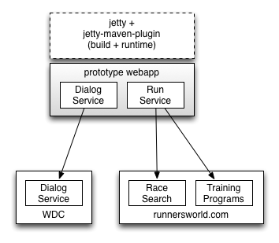

# Watson Prototype Application

## Introduction

This prototype application uses [IBM Watson's Dialog service](http://www.ibm.com/watson/developercloud/dialog.html) 
 to help a person find a running race and a training plan 
 for preparation. The races and plans are hosted on the 
 [Runner's World](http://www.runnersworld.com/)



## Prerequisites

- Java 7 JDK
- Maven 3
- cURL

## Building and running 

The application can be built and started with the jetty-maven-plugin:

```
mvn:jetty
```

## Remote debugging

To enable remote debugging, run the following before invoking `mvn jetty:run`:

```
    export MAVEN_OPTS="-Xdebug -agentlib:jdwp=transport=dt_socket,server=y,suspend=n,address=5005"
```

This will allow remote debugging on port 5005
